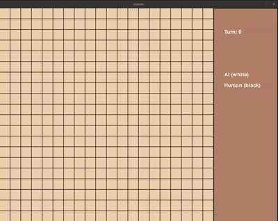

# ♟️ Gomoku AI — Minimax with Alpha-Beta Pruning

**Gomoku AI** is a Python implementation of the classic board game "Five in a Row", powered by a smart AI opponent using the **Minimax algorithm with Alpha-Beta pruning**. Play against a tactical AI and test your skills!

---

## 🎥 Demo

<p align="center">
  
</p>

> 🧠 The AI thinks before every move and reacts based on board threats. The game is built using Pygame with a clean, minimal interface.

---

## 🧠 AI Features

* ✅ Minimax Algorithm
* ⚡ Alpha-Beta Pruning for efficient tree pruning
* 🧠 Heuristic Evaluation Function (threat detection, score weighting)
* 🧪 Configurable depth and evaluation weights

---

## 🖥️ UI Features

* 🎯 Interactive grid with mouse-based gameplay
* 🔄 Planned: Restart button, visual highlights, turn indicator
* 🧱 Built using **Pygame**

---

## 📁 Clean Project Structure

```
gomoku-ai/
├── ai/
│   └── ai_algorithm.py        # Minimax + Alpha-Beta logic
│
├── core/
│   ├── data_structure.py      # Board representation, constants
│   ├── move_function.py       # Move logic: generate, validate, apply
│   └── gomoku_rules.py        # Win checking, game over detection
│
├── ui/
│   └── main.py                # Pygame interface + game loop
│
├── assets/
│   └── demo.gif               # Demo gif or screenshots
│
├── docs/
│   └── gomoku.txt             # Game rules, strategy docs, notes
│
├── board.txt                 # Optional board preset or save
├── requirements.txt
├── README.md
└── .gitignore
```
---

## 🛠️ Installation

### 1. Clone the repository

```bash
git clone https://github.com/yourusername/gomoku-ai.git
cd gomoku-ai
```

### 2. Install dependencies

```bash
pip install pygame
```

---

## 🚀 Run the Game

```bash
python ui/main.py
```

---

## 🧪 AI Logic

* Score patterns (rows of 2, 3, 4)
* Penalize opponent’s strong positions
* Alpha-beta pruning reduces computation by skipping branches
* Centralized weighting for better opening strategy

---

## 🔧 Planned Improvements

* [ ] Highlight last move and current player
* [ ] Restart & Undo options
* [ ] Difficulty selector (depth)
* [ ] Menu screen & sound effects

---

## 📜 License

MIT License — Free to use, modify, and distribute.

---

## 👤 Author

**Dange-Marie**
🧠 AI/ML developper
🔗 [GitHub](https://github.com/yourusername)

**Omer DEDO**
🔐 Cybersecurity Analyst
🔗 [GitHub](https://github.com/200omer)
